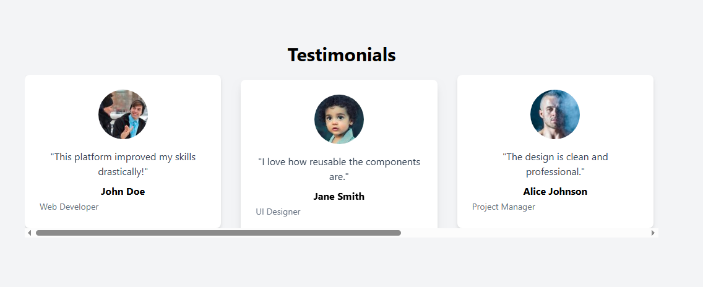

# Testimonial Slider UI | Tailwind CSS

This project is a responsive testimonial slider built entirely using **Tailwind CSS**. It showcases multiple testimonial cards in a **horizontal scrollable** slider format. Users can view three testimonial cards at a time on larger screens, and additional cards appear smoothly as the user scrolls horizontally.

The design demonstrates the use of **flexbox, horizontal scrolling, snapping,** and **card styling** with a professional, clean UI.

# Features

**Responsive design:** Adapts to desktop, tablet, and mobile screens.

**Horizontal scroll slider:** Users can scroll to view more testimonials.

**Snap scrolling:** Smooth snapping effect for a professional UX.

**Card hover effect:** Each card slightly rises and shadows on hover for interactivity.

**Custom scrollbar:** Horizontal scrollbar is styled for better appearance.

**Reusable components:** Each testimonial card is styled in a consistent manner and can be easily reused.

# Technologies Used

Html5

Tailwand CSS **(Play CDN)**

# How It Works

**The main slider container uses:**

**flex flex-nowrap →** Keeps cards in a single horizontal line

**gap-8 →** Spacing between cards

**overflow-x-auto →** Enables horizontal scrolling

**overflow-y-hidden →** Hides vertical scroll to prevent vibration

**snap-x snap-mandatory →** Smooth snapping behavior

# Testimonial Cards:
**Each card uses:**

**flex-shrink-0 →** Prevents cards from shrinking

**w-[calc(33.333%-1.5rem)] →** Each card takes 1/3 width minus spacing

**snap-start →** Ensures smooth snapping

**hover:translate-y-2 + hover:shadow-lg →** Interactive hover effect

# Usage

Open the index.html file in a browser.

Scroll horizontally to view all testimonial cards.

Hover over cards to see interactive effects.

# Preview

# Notes

The project is built using pure Tailwind CSS without any external JS libraries.

Additional testimonial cards can be added easily by duplicating the card 
 inside the slider container.

The horizontal scroll experience works best on modern browsers that support CSS flexbox and snap points.

# Future Improvements

Add left/right navigation buttons for easier scrolling.

Enable auto-slide animation for dynamic display.

Enhance accessibility with keyboard navigation.

Make it fully responsive with mobile-first breakpoints for 1-2 cards on smaller screens.

**Author: Waleed Arshad Kayani**